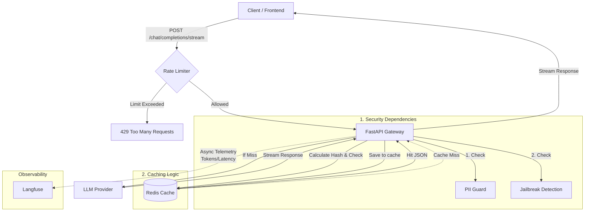

# Local Development Prerequisites

- Use makefile to run redis-stack with `make up-redis-stack`
- Install pip via uv `uv pip install pip`
- Preload models only for once `python scripts/download_models.py` this will load models into `~/.cache/huggingface/hub`

# Architecture

