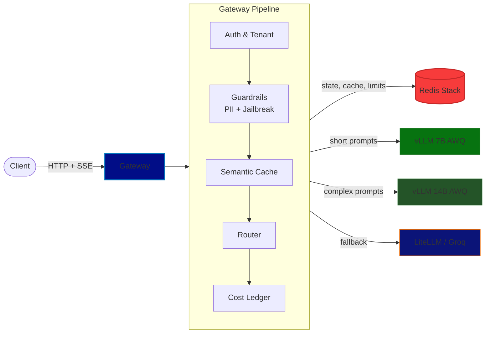

# LLM Gateway

A production-pattern gateway for LLM serving — multi-tenant rate limiting,
semantic caching, content guardrails, and intelligent routing between
inference backends.

[](LICENSE)
[](https://www.python.org/)

## Why this exists

Most LLM applications start with `httpx.post()` to OpenAI or `model.generate()`
against a local checkpoint. That works until you have multiple tenants, real
cost constraints, content moderation requirements, or production traffic.

This project implements the gateway pattern that production LLM serving
requires, structured as real code with measured benchmarks.

## Architecture


```mermaid
flowchart LR
    Client([Client]) -->|HTTP + SSE| GW[Gateway]
subgraph Pipeline[Gateway Pipeline]
    direction TB
    Auth[Auth & Tenant] --> Guard[Guardrails<br/>PII + Jailbreak]
    Guard --> Cache[Semantic Cache]
    Cache --> Route[Router]
    Route --> Ledger[Cost Ledger]
end
GW --> Pipeline
Pipeline -->|state, cache, limits| Redis[(Redis Stack)]
Pipeline -->|short prompts| VS[vLLM 7B AWQ]
Pipeline -->|complex prompts| VL[vLLM 14B AWQ]
Pipeline -->|fallback| LL[LiteLLM / Groq]
style GW fill:#010d87,stroke:#0277bd,stroke-width:2px
style Redis fill:#f73b3b,stroke:#c62828,stroke-width:2px
style VS fill:#077310,stroke:#2e7d32
style VL fill:#245428,stroke:#2e7d32
style LL fill:#0b1478,stroke:#ef6c00
```


Every request passes through auth → guardrails → cache lookup → routing →
streaming inference → ledger accounting. State lives in Redis. Inference
goes to vLLM with continuous batching, falling back to a hosted provider
on backend failure.

## Headline benchmark

Measured on NVIDIA H100 80GB. Naive baseline = HuggingFace Transformers
fp16 with `asyncio.Lock` serialization (the "first attempt" implementation).

| Metric | Gateway | Naive baseline | Speedup |
|---|---|---|---|
| TTFT p99 (single-stream) | 82ms | 3.95s | **48×** |
| Total p50 (concurrent c=4) | 3.19s | 15.66s | **4.91×** |
| Throughput at c=4 | 1.04 req/s | 0.18 req/s | **5.66×** |
| Sustained capacity | c=8 (99% success) | c=4 ceiling | architectural gap |

The 4.91× speedup at c=4 is the cleanest finding — both implementations
succeed at 100%, but the gateway delivers responses ~5× faster end-to-end
because vLLM's continuous batching processes 4 concurrent requests in
parallel while the naive baseline serializes them.

[Full benchmark results →](docs/benchmarks/RESULTS.md)

## What's in here

| Component | Stack |
|---|---|
| Gateway service | Python 3.12, FastAPI, async/await throughout |
| State & limits | Redis Stack with Lua scripts for atomic operations |
| Inference | vLLM (continuous batching, AWQ quantization) |
| Fallback | LiteLLM (provider-agnostic API) |
| Observability | OpenTelemetry, Langfuse |
| Benchmarks | Custom harness with single/steady/burst patterns |
| Deployment | Docker Compose (local), Kubernetes manifests (production) |

## Quick start

```bash
git clone https://github.com/yourname/llm-gateway.git
cd llm-gateway
docker compose up -d

curl -N http://localhost:8000/v2/chat/completions
-H "Content-Type: application/json"
-H "X-Tenant-Id: demo"
-d '{ "model": "auto", "messages": [{"role": "user", "content": "Hello!"}] }'